# REPORT
<h1 align="center">Jobbr: Job Recruitment Site</h1>

<b>By</b>: Gorramuth Praserkull 
<b>ID</b>: 6280632 
<b>Submitted to</b>: Dr. Boonyanit Mathayomchan 
<b>Website</b>: https://elegant-wiles-jobbr-6280632.netlify.app 

Jobbr is a job recruitment website where users are able to sign up and create an account as either a normal user who can apply for jobs, or as an employer who can create job posts and view users who applied.

 

Jobbr is created using Vue 3 with firebase as its backend. It is capable of performing CRUD operation which will be further expounded upon in the report below, and all of the pages have routing to different parts of the site. Dynamic routing is applied to the user profile pages, where every registered user accounts will have unique links to their profiles which varies according to the unique ID key assigned to them during registration. As for the company page, the employer is simply directed to the "/company" route since there are no viewable company profiles, and the page act as a control panel for employer to post jobs or manage existing job posts.

 

In terms of authorization and authentication, the primary authentication method is done through the log in and log out system, where the global variables inside the application that previously stored the default values will receive token and information from firebase and reassign them to the global variable. Once this is done, the user will be authenticated by the token and the retrieved unique ID number from the database to identify their account type as either a "user" or an "employer". User IDs will start with a "U" in front of their IDs, while employer IDs will start with an "E" in front of their IDs. Refreshing the page, or directly going to a certain url without being done through the site itself, will result in the authentication being reset and the user will have to login again. A logged in user attempting to access the "/company" route, will find themselves unable to do so. This is also a form of authorization in which logged out users, with the global variable that identifies them being set to "Guest", will be restricted only to certain pages and unable to access account of company page without first logging in. In the main.js file, the meta property of some routes will specify a notGuest property which only allows access to those routes if the user is not a Guest, as in the user must log in.

 

<h2 align="center">Sign Up Page</h2>

New users can create their first account in the Sign Up page. They are required to enter all of the fields before the registration is accepted. If the user left some fields blank, the form will refuse to submit and a notification will urge them to fill out all of the areas before submission is accepted. Three of the fields have extra validation requirements. If the user enters a invalid email, an error will be displayed above the form. In both of the password fields, the user must enter a strong password that includes a number, a lowercase, and an uppercase character. Failure to do so will display an error message above the form. Moreover, if both of the password fields do not match, the password field will be outlined in red to further emphasize the mistake. Once the user has successfully entered all of the fields correctly, clicking the register will result in a modal popup notifying the user that the registration is successful and gives them to option to proceed to login or to dismiss.

 

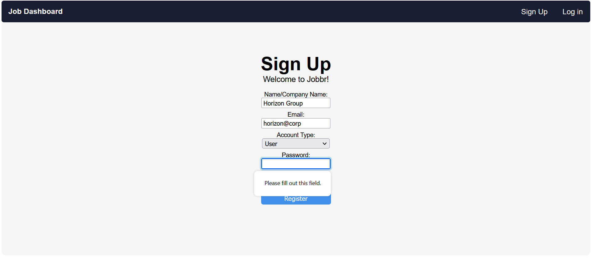
All fields must be filled to sign up

 

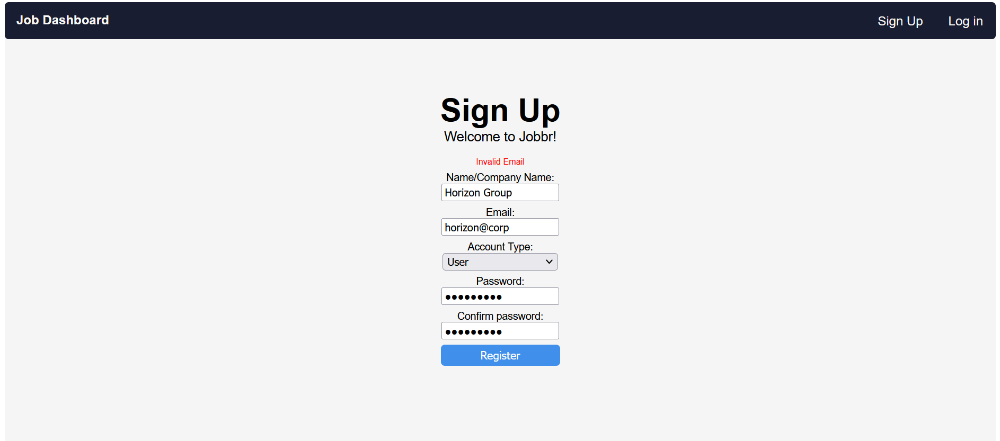
Invalid email error

 

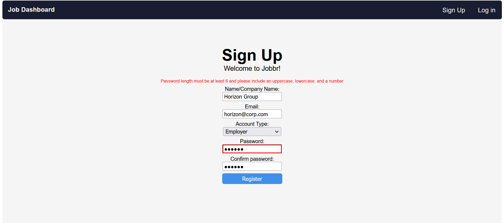
Invalid password error

 

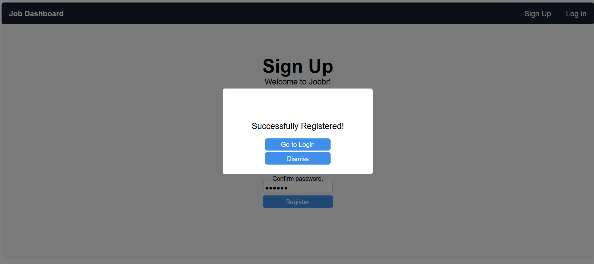
Successfully signed up

 

The Sign Up page will need to create an account for the user on two jsons, the userProfiles.json and accounts.json. Since the user is not logged in while signing up, there is no authentication token, so both of the jsons' write rules are enabled without being restricted, or else the Jobbr wouldn't be able to create entries for the account in both of the jsons. For employers, their registration entry will be created inside accounts.json, while for normal users, both entries in accounts.json and userProfiles.json will be created. All entries will have a unique randomly generated ID assigned to the accounts, IDs starting with "U" indicates a user while "E" indicates an employer. PUT requests will be sent, and the entries are created once the user click register.

 

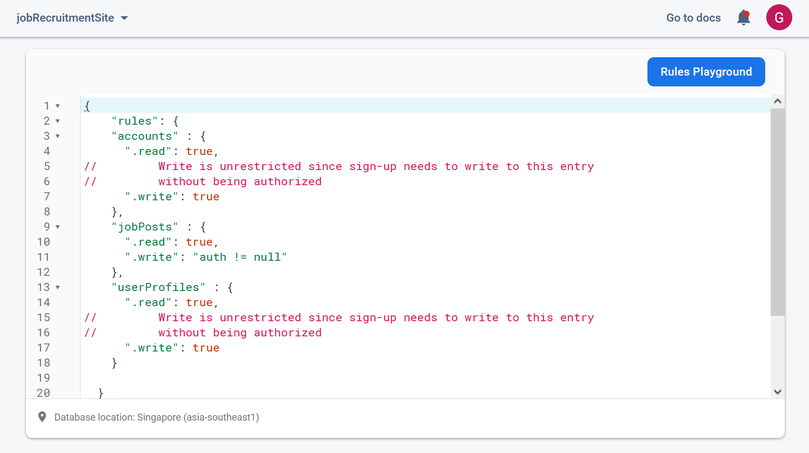
Firebase rule for each json. Write is not locked in order for sign up to create entries during registration.

 

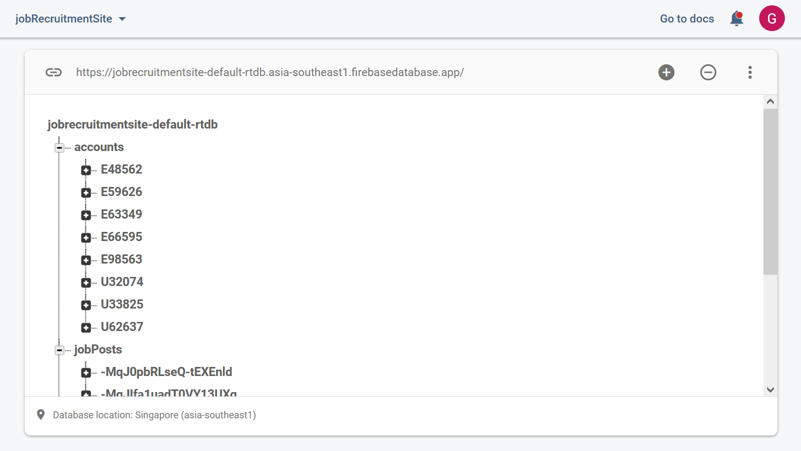
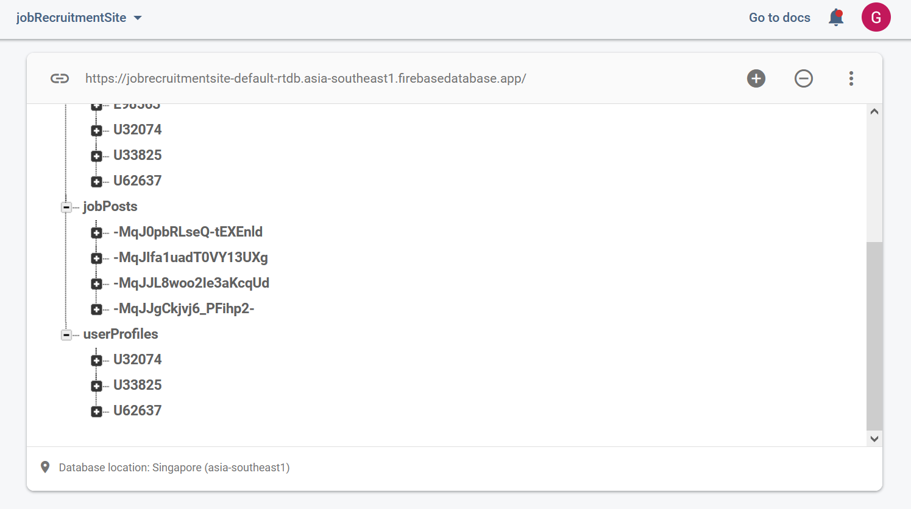
Entries in each json

 

<h2 align="center">Log In Page</h2>

Existing users can log in to their account in order to be authenticated and access Jobbr's features. Inputs are validated by requiring the users to fill in both the Email and Password fields before being authenticated. If the email and password do not match the entry stored on firebase from the POST request response or if the account does not exist, an error will be displayed. Once the correct account is entered, the web application's global variables will now take on the data values from firebase's response, and the authenticated user will be redirected to the main dashboard page.

 

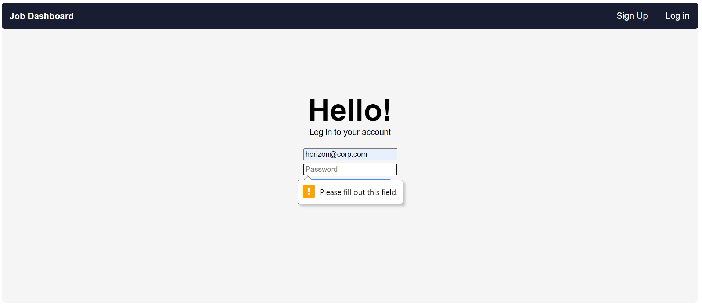
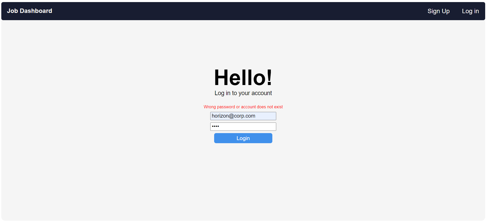
Validation and error prompt for login

 

<h2 align="center">Log Out Page</h2>

Logged in users who wish to log out can simply access the page through the top right of the navigation bar. They will be asked to confirm their choice and once the Confirm Logout button is pressed, the global variables will be set back to its default values. The users will now be logged out and a button to return to the main Job Board page is displayed to them.

 

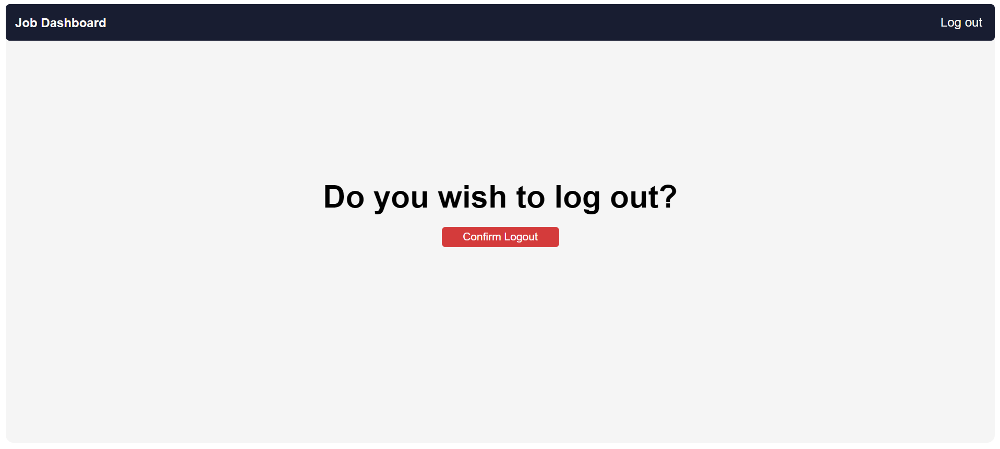
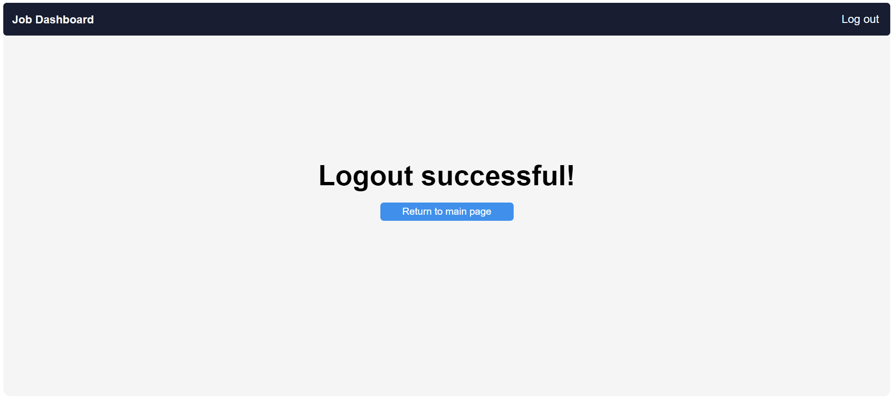
Logout sequence

 

<h2 align="center">Job Board Page</h2>

The Job Board page is the main dashboard for the web application. When first accessing the site even without any route "/", the users will be redirected to this page "/main". The navigation bar provides easy access for the users to easily return to the main page simply by clicking on the Job Dashboard tab on the top left corner. The Job Board page has two states, for non-logged in users (Guest) and employers, they will be able to view all of the jobs that have been posted by every company on this page. This is done through a GET request to the jobPosts.json and passes that data for each respective company down to the JobPost component. As for logged-in users, they will have access to a button which allows them to apply to a specific job post, or a withdraw button if they wish to withdraw from a job that they have previously applied. The withdraw button will emit the job post's ID back for the function in the main job board component to process the applicant's withdrawal. This is a slight difference from what was written in the proposal that the apply button will grey out. I believe that this is a more intuitive and straightforward design. An optional feature which is the filter dropdown menu allows the users to easily filter out jobs by their industries as set by the employers' side or to view all the ones that they have applied.

 

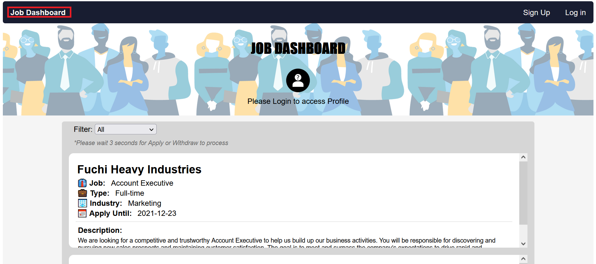
The outlined area can be clicked to return to the Job Board

 

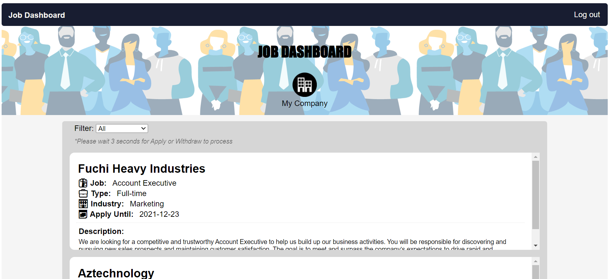
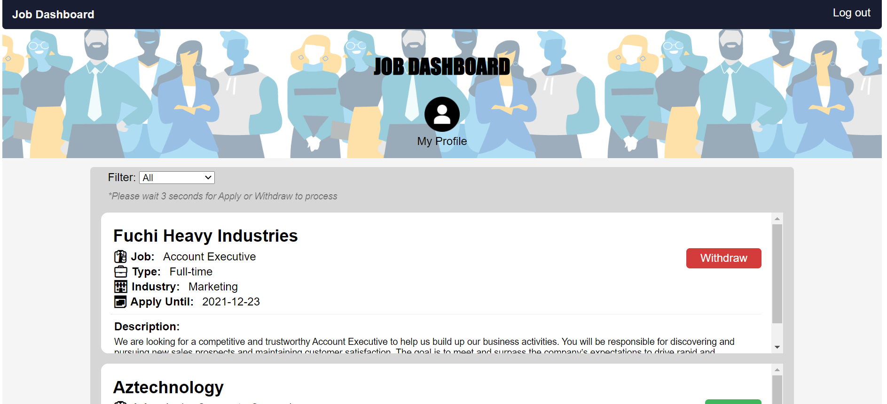
Different page features for different account types

 

No available job when filtered

 

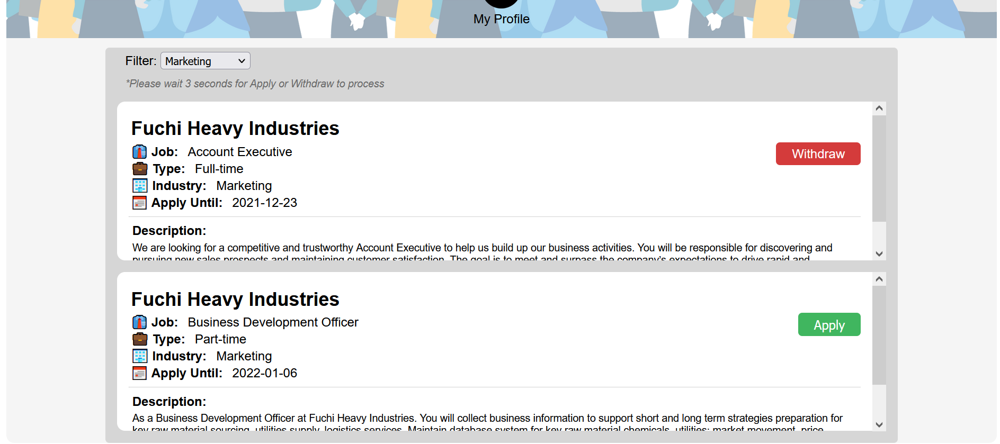
Filter can be used to display jobs in the selected industry

 

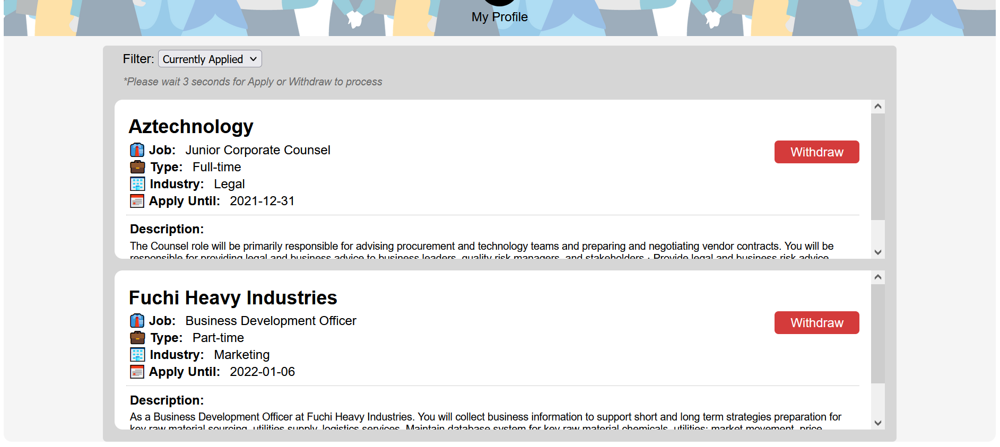
Viewing currently applied jobs

 

A disclaimer will also inform the users that after their application, Jobbr will take three seconds to process their request before their application or withdrawal goes through. This is because the PUT requests to firebase are not processed instantly, and firebase takes a short moment to fully update the entry to the database. If the program sends a GET request immediately after PUT, firebase will return the old data back. A workaround was implemented to include a timout of 3 seconds before calling the function to retrieve the new data from firebase. Finally, the user can click the My Profile link for normal user accounts, or My Company link for employer accounts below the page title to access their account's page.

 

<h2 align="center">User Profile and Edit User Profile Pages</h2>

The user profile page is dynamically routed by the user account ID in the address bar. All of the information in this page is prefilled by a GET request to the database to retrieve information from userProfiles.json from the respective user ID. This page can not be accessed by Guests and employers will be able to access a link to this page from the job applicant list on their page. The edit functionality is hidden for everyone who is viewing this page except for the owner of them profile. If the logged in user's authenticated ID matches the page's user ID, the edit button will be shown at the bottom of the page which links to the Edit User Profile page.

 

Owner of the profile can edit the page, other people can only view

 

In the Edit User Profile page, information are similarly prefilled from the userProfiles.json database, however, every field except for email (Which can not be changed since it is used for logging in) are editable. The users are free to edit or leave any field blank as they wish, however two of the fields are validated. Users must enter their phone number with dashes according to the placeholder format, and the website field must be a valid url link. Once the users are satisfied, they can click save and a success message will display shortly, while a PUT request will be sent to firebase to update the information stored in the json entry. They can choose to click the back button to return to their profile page and view their changes.

 

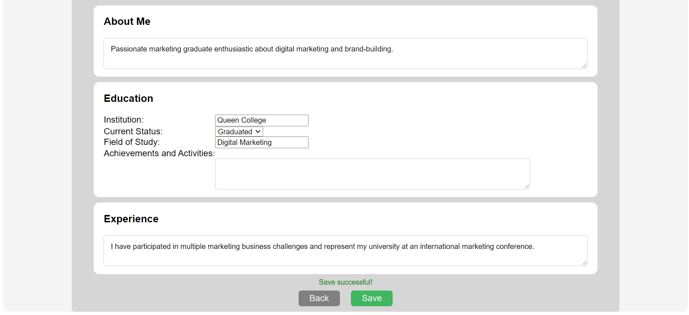
Save successful message

 

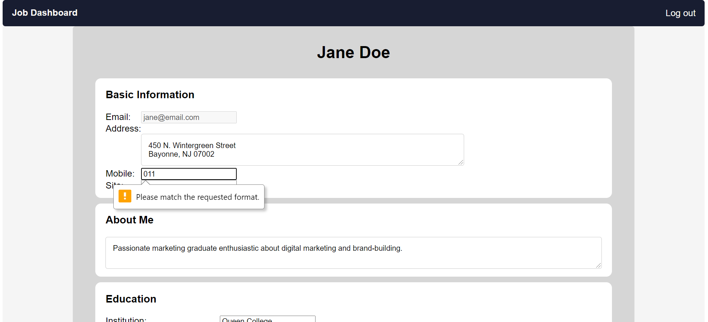
Validation prompt

 

<h2 align="center">Employer Page</h2>

The employer page is accessible only from an employer account type. They can access this page through the My Company link from the Job Board page. In this page, employers can view existing jobs that they have previously posted, or they can post a new job from the control panel at the top of the page. When creating a job post, all the fields are required to have input. Once the employer click post, a POST request is sent to create an entry for the job post in the jobPosts.json in firebase. Posted jobs can not be modified since to ensure information symmetry with previously applied users. A GET request will retrieve all of the jobs in jobPosts.json associated with the logged in company, and display them below the control panel. In each job post on the employer's side, they can choose to view applicants or delete the post. The show applicant button will toggle the job description area into a list of applicant links. Employers can click on the links to go to the applicant's profile page and view their information. Then they can click the back button at the end of the user profile that they are currently viewing to return to this page (The employer can not new tab the link since it will reset their authentication which is required to access the profile pages). Should the employer want to delete the job post, they can press the delete button and after three seconds, the DELETE request will be processed by firebase and the job post will be removed from the Employer page and the main Job Board page.

 

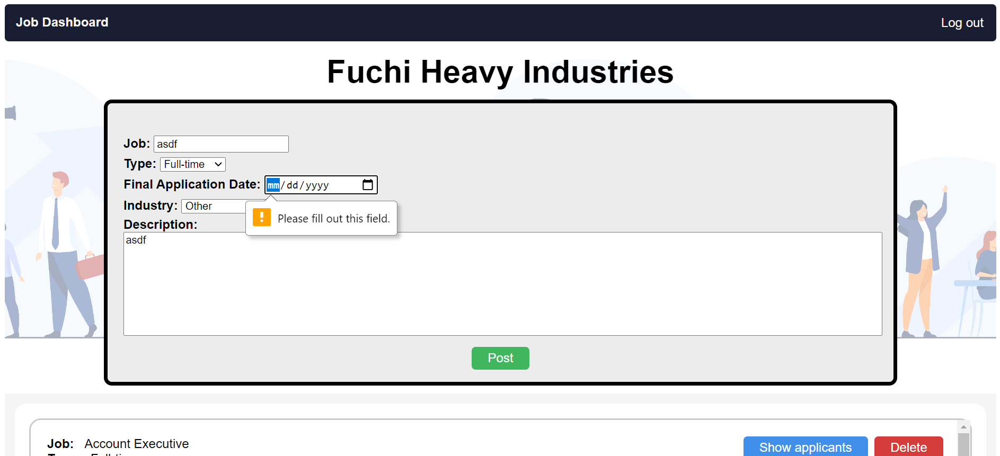
All fields must be filled before posting job

 

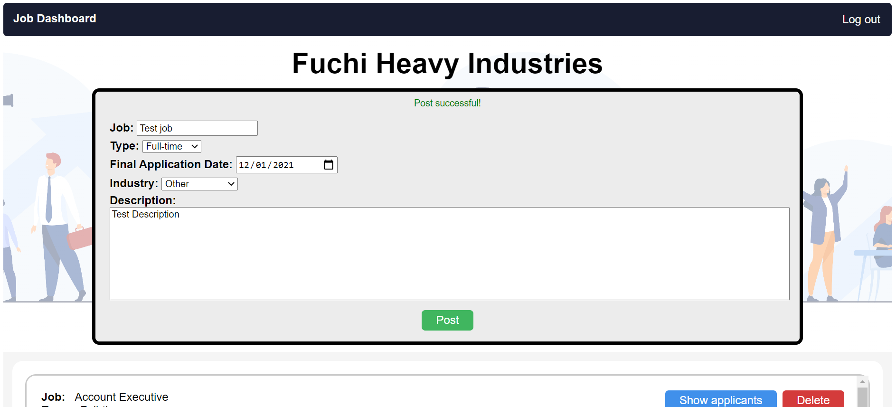
Post success message

 

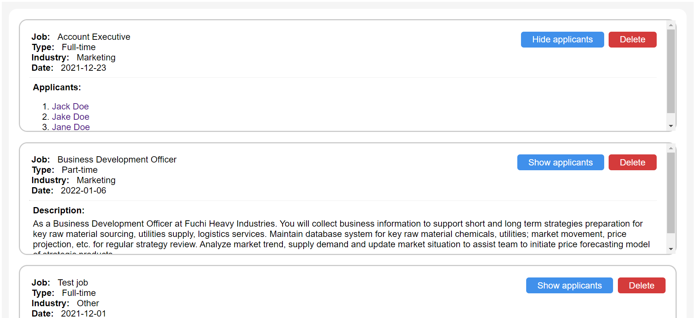
Applicant toggle

 

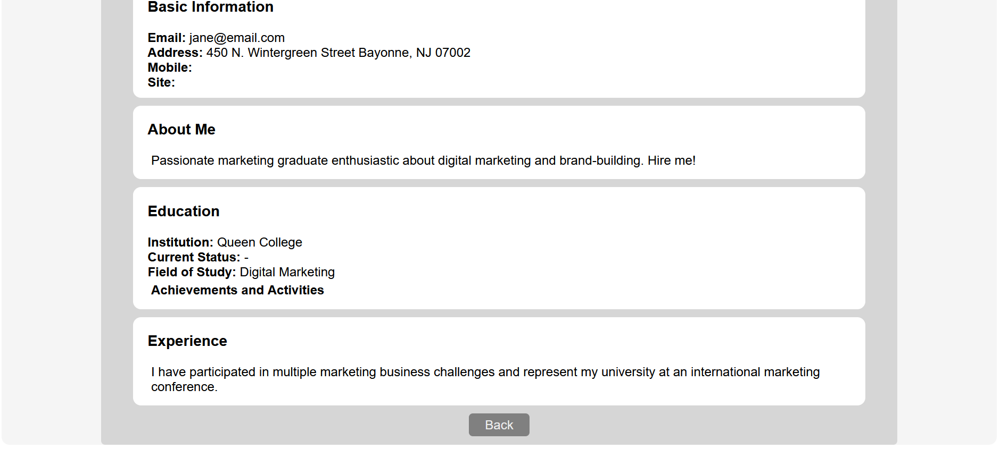
Press back on your current applicant profile to return after viewing

 

<h2 align="center">Unauthorized Page</h2>

This page serves as a corner case if users are somehow able to access routes that are unauthorized to their account type or if they haven't been authenticated. It will display a message prompting them to return back to the main Job Board page. However, this page is inaccessible from Netlify by default since Netlify prevents the modification of url.

 

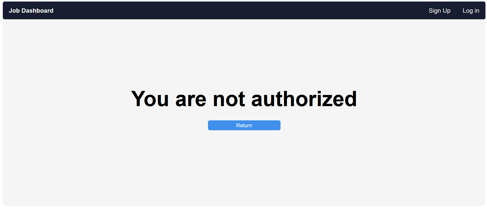
Unauthorized users are routed to a landing page

 

This concludes the report on the Jobbr job recruitment web application. All of the proposed features have successfully been implemented, additional information on scope and further notes on some points of interests are detailed below. A more in depth look at how the web application functions can be viewed in the source code which I have provided accompanying comments to clarify certain functions and parts in each vue components.

 

<i>A note on DatabaseService.js:</i>
 
A firebase database service has been added to this application and used once for to query information from the firebase database on the EmployerJob component. I do realize that this is a more direct and efficient way to retrieve information without having to process all of the json entries, however since it is not covered in class and I have not taken Database yet, I only use it once to compare the simplication of the process that I use to process data from axios on other components.

 

<i>The following test accounts are provided</i>:
 
<b>Employer</b>: atech@corp.com, fuchi@corp.com, spinrad@corp.com, nova@corp.com
 
<b>User</b>: jack@email.com, jane@email.com, jake@email.com
 
<b>Password</b>: 1234Aa (For all accounts)

 

<i>Source compilation</i>:
 
<b>Navbar and Button</b>: Modified from https://www.w3schools.com/css/css_navbar.asp and https://www.w3schools.com/css/css3_buttons.asp
 
<b>Page title changer</b>: Referenced from https://stackoverflow.com/questions/36612847/how-can-i-bind-the-html-title-content-in-vuejs
 
<b>Modal view</b>: Modified from https://www.w3schools.com/howto/howto_css_modals.asp
 

## What features are partially available (or still contain bugs).

All of Jobbr's proposed core features and an optional feature are fully available and showed no discernable bugs after multiple rounds of testing.

## What features that you cannot complete (explain why so)

The (optional) feature of Messaging option can not be completed. After careful deliberation of ways to approach how to implement a directed messaging capability between the applicant user and employer, I have found that it is quite beyond the scope of the project in the allotted timeframe and contains materials that are not touched upon in class. There is also the case of database bloat, and how to represent communication between both of the participants in a directed channel that will be available to both sides that will becoming increasingly complex as the user apply to more companies and no suitable way to manage that. The feature is a nice-to-have, but not necessary since under normal circumstances, once the employer have the applicant's email, communication will usually be conducted through that channel. Therefore, I have decided to not pursue this feature.

## What features shall be added (if you would have more time)

- <b>Company profile page</b>: For viewing all jobs specific to the company and any news update that the company may wish to post  
- <b>File upload feature</b>: For user to upload their resume or their profile pictures onto their profile page
